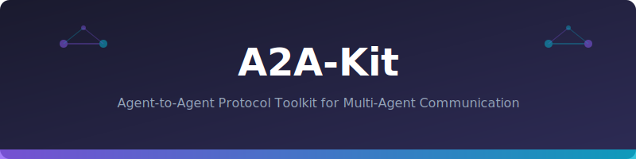
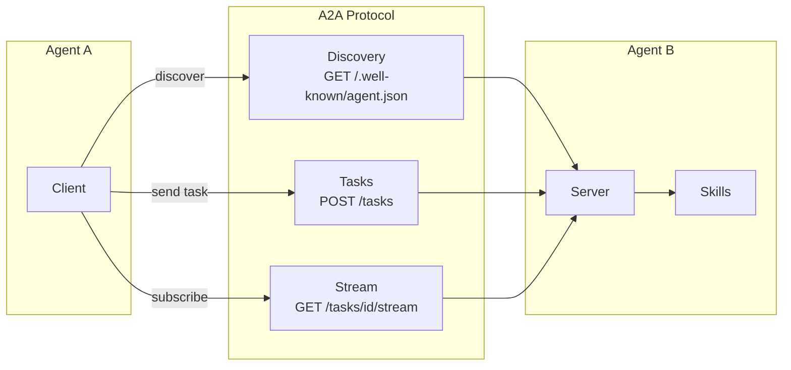

<p align="center">
  
</p>

# 🔗 A2A-Kit

[](https://www.python.org/downloads/)
[](LICENSE)
[]()
[]()

**Production-ready SDK for Google's Agent-to-Agent (A2A) protocol — build interoperable AI agents in minutes.**

```
┌─────────────────────────────────────────────────────────────────┐
│                        A2A-Kit                                   │
├─────────────────────────────────────────────────────────────────┤
│                                                                  │
│  ┌──────────┐    ┌──────────────┐    ┌───────────────────┐     │
│  │  Agent   │───▶│  Task        │───▶│  Streaming /      │     │
│  │  Card    │    │  Lifecycle   │    │  Push Notify      │     │
│  └──────────┘    └──────────────┘    └───────────────────┘     │
│       │                │                      │                  │
│       ▼                ▼                      ▼                  │
│  ┌──────────┐    ┌──────────────┐    ┌───────────────────┐     │
│  │ Discovery│    │  Executor    │    │   Transport       │     │
│  │ Registry │    │  Framework   │    │   HTTP / SSE      │     │
│  └──────────┘    └──────────────┘    └───────────────────┘     │
│                                                                  │
└─────────────────────────────────────────────────────────────────┘
```

## Why A2A-Kit?

| Problem | A2A-Kit Solution |
|---------|-----------------|
| Agents can't discover each other | **Agent Cards** with capability declarations |
| No standard task handoff protocol | **Task lifecycle** (submitted → working → done) |
| Long tasks timeout in sync mode | **SSE streaming** with progress updates |
| No way to validate implementations | **Conformance test suite** included |
| Boilerplate for every new agent | **Decorators** — 5 lines to register a skill |

## Quick Start

```python
from a2akit import AgentServer, skill, AgentCard

# Declare your agent
card = AgentCard(
    name="Weather Agent",
    description="Provides weather forecasts for any location",
    skills=["weather_forecast", "weather_alerts"],
)

server = AgentServer(card=card)

@server.skill("weather_forecast")
async def forecast(task):
    city = task.message
    # Your logic here...
    return f"Weather in {city}: Sunny, 24°C"

# Start serving A2A protocol
server.run(port=8080)
```

```bash
# Discover the agent
curl http://localhost:8080/.well-known/agent.json

# Send a task
curl -X POST http://localhost:8080/tasks \
  -H "Content-Type: application/json" \
  -d '{"message": "Weather in Berlin"}'
```

## Features

### 🎯 Agent Cards
```python
from a2akit import AgentCard, Skill, AgentCapabilities

card = AgentCard(
    name="Order Analyst",
    description="Analyzes maintenance orders",
    url="https://my-agent.example.com",
    capabilities=AgentCapabilities(
        streaming=True,
        push_notifications=False,
    ),
    skills=[
        Skill(id="search_orders", description="Search maintenance orders by filters"),
        Skill(id="get_costs", description="Get cost breakdown for an order"),
    ],
)
```

### 🔄 Task Lifecycle
```python
from a2akit import TaskStatus

# Tasks flow through states:
# SUBMITTED → WORKING → COMPLETED
#                    → FAILED
#                    → INPUT_REQUIRED → WORKING → ...

@server.skill("complex_analysis")
async def analyze(task):
    task.status = TaskStatus.WORKING
    yield "Analyzing order data..."     # streaming update

    task.status = TaskStatus.WORKING
    yield "Computing risk scores..."    # streaming update

    return {"risk_score": 0.73, "recommendation": "Review before TECO"}
```

### 📡 Streaming (SSE)
```python
@server.skill("long_report")
async def report(task):
    """Long-running task with streaming progress."""
    for i in range(10):
        yield f"Processing batch {i+1}/10..."
        await asyncio.sleep(1)

    return "Full report: ..."
```

### 🔍 Agent Discovery
```python
from a2akit import AgentRegistry

registry = AgentRegistry()
registry.register("http://localhost:8080")
registry.register("http://localhost:9090")

# Find agents by capability
agents = registry.discover(skill="weather_forecast")
# → [AgentCard(name="Weather Agent", ...)]
```

### ✅ Conformance Testing
```bash
# Validate your agent implements A2A correctly
python -m a2akit.conformance http://localhost:8080

# Output:
# ✓ Agent card served at /.well-known/agent.json
# ✓ Card has required fields (name, description, skills)
# ✓ POST /tasks returns valid task object
# ✓ Task status transitions are valid
# ✓ Streaming endpoint sends valid SSE events
# ✓ Error responses follow A2A error schema
# PASSED: 6/6 checks
```

## Installation

```bash
pip install a2akit
```

## Architecture



## API Reference

| Class | Purpose |
|-------|---------|
| `AgentServer` | HTTP server implementing A2A protocol |
| `AgentClient` | Client for calling other A2A agents |
| `AgentCard` | Agent capability declaration |
| `AgentRegistry` | Multi-agent discovery registry |
| `Task` | Task object with lifecycle management |
| `Skill` | Skill declaration with metadata |
| `conformance` | Test suite for protocol compliance |

## Protocol Compliance

Implements the full [A2A specification](https://github.com/google/A2A):

- [x] Agent Card discovery (`/.well-known/agent.json`)
- [x] Task submission (`POST /tasks`)
- [x] Task status polling (`GET /tasks/{id}`)
- [x] Server-Sent Events streaming
- [x] Multi-part responses (TextPart, DataPart, FilePart)
- [x] Error schema with codes
- [x] Input-required state for HITL flows

## License

MIT
