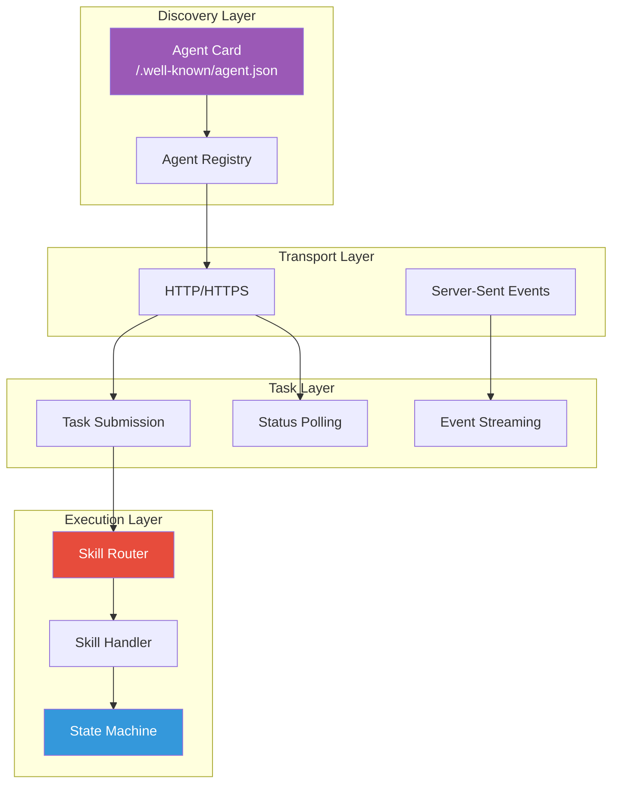
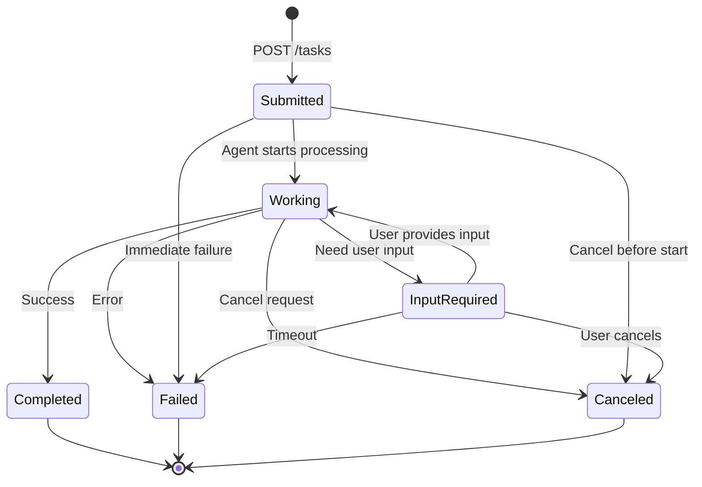
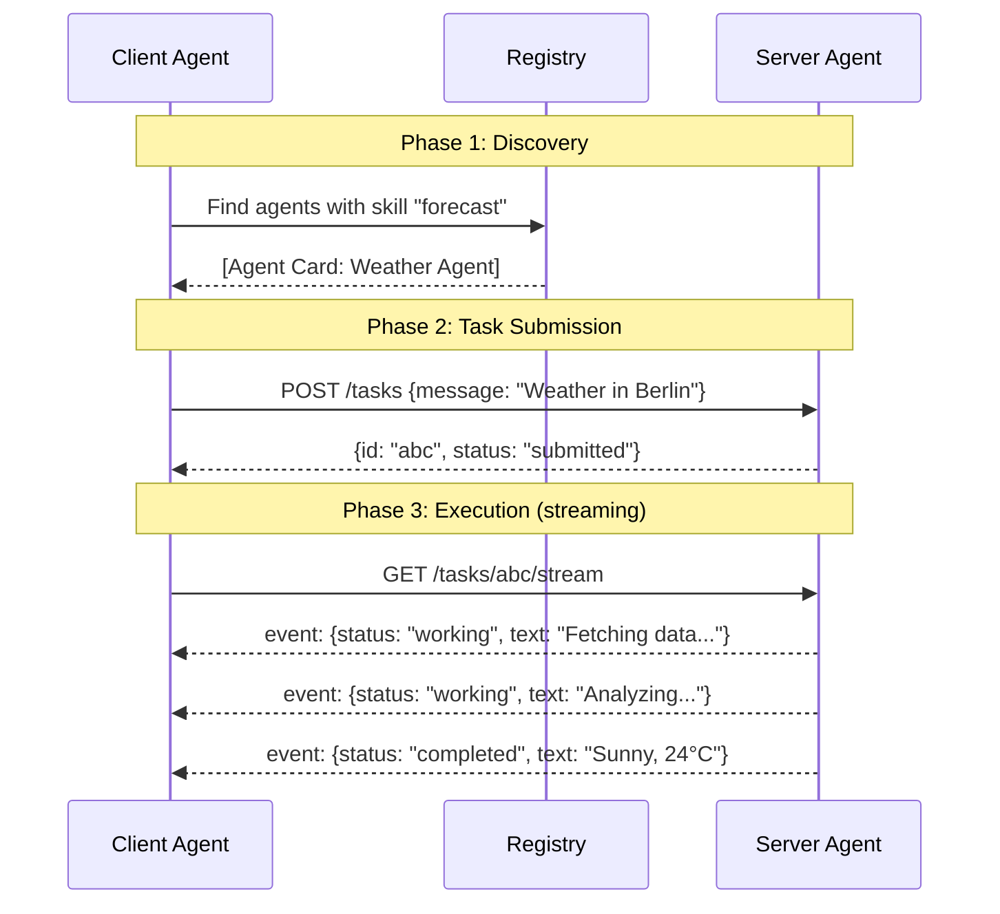
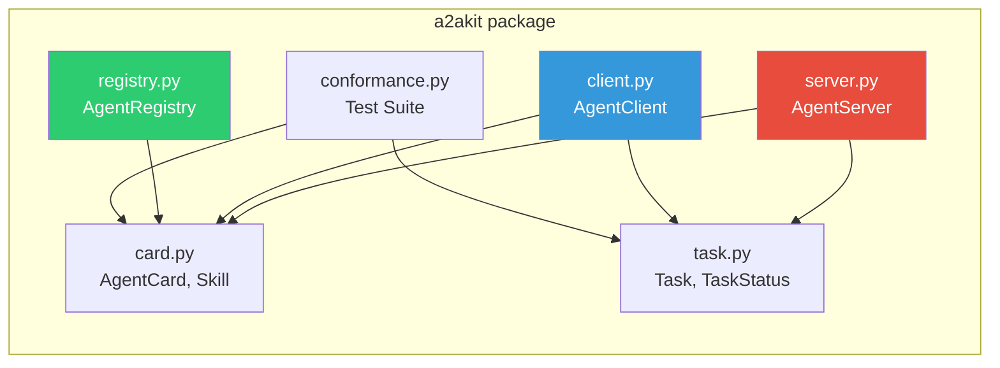
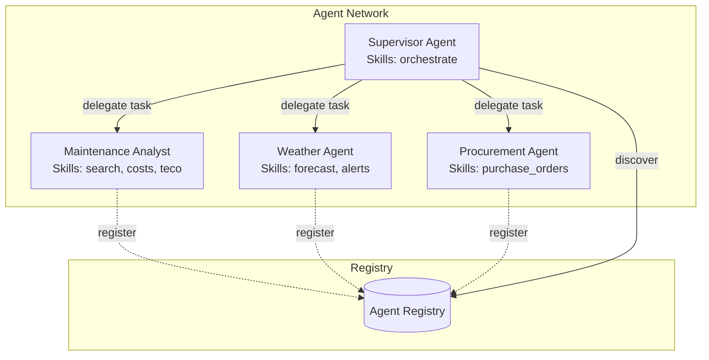

# A2A-Kit Architecture

## Protocol Overview

The Agent-to-Agent (A2A) protocol enables AI agents to discover and communicate with each other through a standardized HTTP-based interface.

## Task State Machine

## Communication Sequence

## Module Architecture

## Multi-Agent Topology

## Performance

| Operation | Latency | Notes |
|-----------|---------|-------|
| Card discovery | < 5ms | JSON parse only |
| Task submission | < 10ms | Routing + handler call |
| State transition | < 1ms | In-memory validation |
| Registry lookup | < 1ms | Dict/set operations |
| Conformance suite | < 50ms | All checks combined |

## Protocol Compliance Matrix

| Feature | A2A Spec | A2A-Kit | Notes |
|---------|----------|---------|-------|
| Agent Card | Required | ✅ | Full `AgentCard` dataclass |
| Task CRUD | Required | ✅ | Create, read, status |
| State machine | Required | ✅ | With transition validation |
| Multi-part messages | Required | ✅ | Text, Data, File parts |
| SSE streaming | Optional | ✅ | Queue-based implementation |
| Push notifications | Optional | 🔄 | Interface defined |
| Authentication | Optional | ✅ | Header passthrough |
| Error schema | Required | ✅ | Standard error responses |
